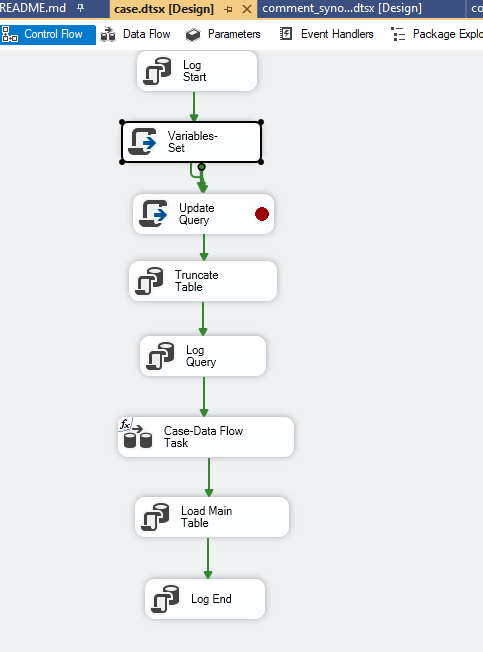
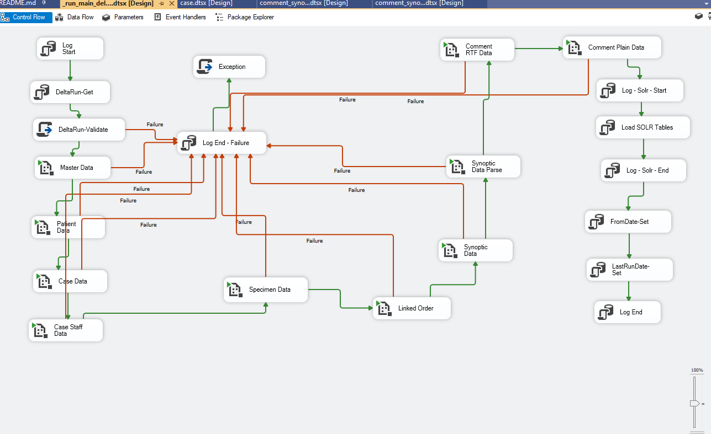

# Introduction

 SSIS Packages to load the data from CLARITY(Oracle) datasource to PIRO Staging tables (SQL Server).
 All the staging tables start with SSIS_

# Getting Started

 1. Install SQL Server Management Studio > V19
 2. Install Visual Studio 2022 or 2015
 3. Install SQL Data Tools V17.8

# Packges

 case.dtsx - Pathology Cases are downloaded
  Source: CLARITY.LAB_CASE_DB_MAIN, CLARITY.LAB_CASE_INFO
  Target: dbo.SSIS_CaseData
  Transaction Table: dbo.[case]
  Loading script: EXEC dbo.P_SSIS_Load_Case @FullLoad = 0
  QUERY: SELECT  LM.CASE_ID, LM.CASE_SUBSPECIALTY_C, LM.CASE_LAB_ID, LM.CASE_ACCESSION_DTTM, LM.CASE_RECEIVED_DTTM, LM.CASE_OVERDUE_DTTM, LM.CASE_COLL_DTTM, LM.CASE_SIGNOUT_DTTM, CI.CASE_TYPE_ID, CI.CASE_NUM, CI.AP_CASE_STATUS_C, LM.CASE_PAT_ID, LM.INSTANT_PAT_ASSOC_UTC_DTTM, LM.PAT_ASSOC_DTTM, LM.LAST_TASK_ADDED_UTC_DTTM, LM.CASE_ACCESSION_UTC_DTTM FROM CLARITY.LAB_CASE_DB_MAIN LM JOIN CLARITY.LAB_CASE_INFO CI ON LM.CASE_ID = CI.REQUISITION_ID  WHERE 1= 1    AND (
  ( CASE_ACCESSION_UTC_DTTM >= TO_DATE('2025-09-01','yyyy-mm-dd') AND CASE_ACCESSION_UTC_DTTM < TO_DATE('2025-09-02','yyyy-mm-dd') )
   OR
  ( LAST_TASK_ADDED_UTC_DTTM >= TO_DATE('2025-09-01','yyyy-mm-dd') AND LAST_TASK_ADDED_UTC_DTTM < TO_DATE('2025-09-02','yyyy-mm-dd') )
   OR
  ( CASE_ACCESSION_DTTM >= TO_DATE('2025-09-01','yyyy-mm-dd') AND CASE_ACCESSION_DTTM < TO_DATE('2025-09-02','yyyy-mm-dd') )
   OR
  ( CASE_RECEIVED_DTTM >= TO_DATE('2025-09-01','yyyy-mm-dd') AND CASE_RECEIVED_DTTM < TO_DATE('2025-09-02','yyyy-mm-dd') )
   OR
  ( CASE_OVERDUE_DTTM >= TO_DATE('2025-09-01','yyyy-mm-dd') AND CASE_OVERDUE_DTTM < TO_DATE('2025-09-02','yyyy-mm-dd') )
   OR
  ( CASE_COLL_DTTM >= TO_DATE('2025-09-01','yyyy-mm-dd') AND CASE_COLL_DTTM < TO_DATE('2025-09-02','yyyy-mm-dd') )
   OR
  ( CASE_SIGNOUT_DTTM >= TO_DATE('2025-09-01','yyyy-mm-dd') AND CASE_SIGNOUT_DTTM < TO_DATE('2025-09-02','yyyy-mm-dd') )
  )

 case_flag.dtsx - Pathology Cases are downloaded
  Source: CLARITY.ZC_CASE_FLAGS
  Target: dbo.SSIS_CaseFlag
  Transaction Table: dbo.CaseFlag
  Loading script: EXEC dbo.P_SSIS_Load_Lookup_Specialty
  QUERY: SELECT * FROM CLARITY.ZC_CASE_FLAGS

 case_staff.dtsx - Case Staff mapping data downloaded
  Source: CLARITY.LAB_RESPONS_PERS, CLARITY.ZC_LAB_AP_ROLE
  Target: dbo.SSIS_CaseStaff
  Transaction Table: dbo.CaseStaff
  Loading script: EXEC dbo.P_SSIS_Load_CaseStaff @FullLoad = 0
  QUERY:  SELECT P.REQUISITION_ID K_REQUISITION_KEY,
   P.RESPONSIBLE_PERS_ID K_EMPLOYEE_KEY,
   LINE,
   R.TITLE RESPONSIBLE_ROLE_DESC
   , P.RESPONSIBLE_DTTM        FROM CLARITY.LAB_RESPONS_PERS P
     LEFT JOIN CLARITY.ZC_LAB_AP_ROLE R on P.RESPONSIBLE_ROLE_C = R.LAB_AP_ROLE_C WHERE 1 = 1
     AND  P.RESPONSIBLE_DTTM >= TO_DATE('2025-09-02','yyyy-mm-dd')

 case_status.dtsx - Case Status Master data
  Source: CLARITY.ZC_AP_CASE_STATUS
  Target: dbo.SSIS_CaseStatus
  Transaction Table: dbo.CaseStatus
  Loading script: EXEC dbo.P_SSIS_Load_Lookup_CaseStatus
  QUERY:  SELECT * FROM CLARITY.ZC_AP_CASE_STATUS

 case_type.dtsx - Case Type Master data
  Source: CLARITY.ZC_TYPE_CASE, CLARITY.ZC_AP_WORKLIST_TYP
  Target: dbo.SSIS_CaseType
  Transaction Table: dbo.CaseType
  Loading script: EXEC dbo.P_SSIS_Load_Lookup_CaseType
  QUERY:  SELECT CT.*, TC.TITLE as TYPE_CASE, WT.TITLE as WORKLIST_TYPE FROM CLARITY.AP_CASE_TYPES CT
     LEFT JOIN CLARITY.ZC_TYPE_CASE TC ON CT.TYPE_CASE_C = TC.TYPE_CASE_C
     LEFT JOIN CLARITY.ZC_AP_WORKLIST_TYP WT ON CT.AP_WORKLIST_TYPE_C = WT.AP_WORKLIST_TYP_C

 case_type_category.dtsx - Case Type Category Master data
  Source: CLARITY.ZC_TYPE_CASE
  Target: dbo.SSIS_CaseTypeCategory
  Transaction Table: dbo.CaseTypeCategory
  Loading script: EXEC dbo.P_SSIS_Load_Lookup_CaseTypeCategory
  QUERY:  SELECT * FROM CLARITY.ZC_TYPE_CASE

 comment_type.dtsx - Comment Type Master data (PIRO specific)
  Source:
  Target:
  Transaction Table: dbo.CommentType
  Loading script: EXEC dbo.P_SSIS_Load_Lookup_CommentType
  QUERY:

 ethnic_group.dtsx - Ehtnicity Master data
  Source: CLARITY.ZC_ETHNIC_GROUP
  Target: dbo.SSIS_EthnicGroup
  Transaction Table: dbo.Ethnicity
  Loading script: EXEC dbo.P_SSIS_Load_Lookup_Ethnicity
  QUERY:  SELECT * FROM CLARITY.ZC_ETHNIC_GROUP

 gender.dtsx - Gender Master data
  Source: CLARITY.ZC_GENDER_CODE
  Target: dbo.SSIS_EthnicGroup
  Transaction Table: dbo.Gender
  Loading script: EXEC dbo.P_SSIS_Load_Lookup_Gender
  QUERY:  SELECT * FROM CLARITY.ZC_GENDER_CODE

 interpreter.dtsx - Interpreter Master data
  Source: CLARITY.RSLTS_INTERPRETER
  Target: dbo.SSIS_Interpreter
  Transaction Table: dbo.Interpreter
  Loading script: EXEC dbo.P_SSIS_Load_Interpreter @FullLoad = 0
  QUERY:  Select
    OG.ORDER_ID, OP.DESCRIPTION ORD_PROC_DESC, OP.RSLTS_INTERPRETER , OP.UPDATE_DATE, OG.REQUISITION_ID, CLA.TITLE PROCEDURE,
    TYP.TITLE TYPE
    FROM CLARITY.ORDER_PROC OP
    JOIN CLARITY.REQ_ORDER_GROUP OG on OP.ORDER_PROC_ID  = OG.ORDER_ID
    JOIN CLARITY.ZC_ORDER_CLASS CLA ON OP.ORDER_CLASS_C = CLA.ORDER_CLASS_C
    JOIN CLARITY.ZC_ORDER_TYPE TYP ON OP.ORDER_TYPE_C = TYP.ORDER_TYPE_C
    WHERE OP.RSLTS_INTERPRETER is NOT NULL  AND  OP.UPDATE_DATE >= TO_DATE('2025-09-03','yyyy-mm-dd')

 lab.dtsx - Hospital Master data
  Source: CLARITY.LAB_INFO
  Target: dbo.SSIS_Lab
  Transaction Table: dbo.Hospital
  Loading script: EXEC dbo.P_SSIS_Load_Lookup_Hospital
  QUERY:  SELECT * FROM CLARITY.LAB_INFO

 language.dtsx - Language Master data
  Source: CLARITY.ZC_LANGUAGE
  Target: dbo.SSIS_Lab
  Transaction Table: dbo.Language
  Loading script: EXEC dbo.P_SSIS_Load_Lookup_Language
  QUERY:  SELECT * FROM CLARITY.ZC_LANGUAGE

 linked_order.dtsx - Linked Orders data
  Source: CLARITY.ORD_LAB_LINKED_ORD
  Target: dbo.SSIS_LinkedOrder
  Transaction Table: dbo.LinkedOrder
  Loading script: EXEC dbo.p_ssis_load_LinkedOrder
  QUERY:  SELECT NULL AS CASE_ID, STR.LAST_RECV_UTC_DTTM, OR2.RESULT_DATE, OP.UPDATE_DATE, OP.ORDER_INST, OP.REVIEW_TIME ,
      RS.REQUISITION_ID,
      LCI.CASE_NUM,
      STR.SPEC_TST_ORDER_ID,
      OLLO.ORDER_ID,
      OR2.ORDER_PROC_ID,
      CC.COMPONENT_ID,
      CC.NAME COMP_NAME,
      CC.EXTERNAL_NAME COMP_EXTERNAL_NAME,
      CC.DFLT_UNITS,
      OP.PROC_ID,
      OP.DESCRIPTION PROC_DESC,
      STR.SPEC_NUMBER_RLTD,
      RS.LINE SPEC_LINE,
      STR.LINE SPEC_TEST_LINE,
      OLLO.LINE LINKED_ORD_LINE,
      OR2.ORD_VALUE,
      OR2.ORD_NUM_VALUE,
      OR2.REFERENCE_LOW,
      OR2.REFERENCE_HIGH,
      OR2.REFERENCE_UNIT,
      OR2.ORD_RAW_VALUE,
      OR2.RAW_LOW,
      OR2.RAW_HIGH,
      STR.REPORTABLE_YN
    FROM LAB_CASE_INFO LCI
    JOIN REQ_SPECIMEN RS ON RS.REQUISITION_ID = LCI.REQUISITION_ID
    JOIN SPEC_TEST_REL STR ON STR.SPECIMEN_ID = RS.REQ_SPECIMEN_ID
    JOIN ORD_LAB_LINKED_ORD OLLO ON OLLO.ORDER_ID = STR.SPEC_TST_ORDER_ID
    JOIN CLARITY.ORDER_RESULTS OR2 ON OR2.ORDER_PROC_ID = OLLO.LAB_LINKED_ORD_ID
    JOIN CLARITY.CLARITY_COMPONENT CC ON CC.COMPONENT_ID = OR2.COMPONENT_ID
    JOIN CLARITY.ORDER_PROC OP ON OP.ORDER_PROC_ID = OR2.ORDER_PROC_ID
    where RS.LINE = 1
     AND  (OR2.RESULT_DATE > TO_DATE('2025-09-03','yyyy-mm-dd') OR OP.REVIEW_TIME > TO_DATE('2025-09-03','yyyy-mm-dd'))

 maritial_status.dtsx - Martital Status Master data
  Source: CLARITY.ZC_MARITAL_STATUS
  Target: dbo.SSIS_MatrialStatus
  Transaction Table: dbo.MaritalStatus
  Loading script: EXEC dbo.P_SSIS_Load_Lookup_MaritalStatus
  QUERY:  SELECT * FROM CLARITY.ZC_MARITAL_STATUS

 patient.dtsx - Patient Profile data
  Source: CLARITY.PATIENT
  Target: dbo.SSIS_Patient
  Transaction Table: dbo.Patient
  Loading script: EXEC dbo.P_SSIS_Load_Patient @Full_Load = 0
  QUERY:  SELECT
    P.PAT_ID,
    PAT_MRN_ID,
    EPIC_PAT_ID PAT_EPI_ID,
    PAT_TITLE_C PAT_PREFIX_NM,
    PAT_FIRST_NAME PAT_FIRST_NM,
    PAT_MIDDLE_NAME PAT_MI_NM,
    PAT_LAST_NAME PAT_LAST_NM,
    PAT_NAME PAT_FULL_NM,
    CITY PAT_CITY,
    S.NAME PAT_STATE,
    C.NAME PAT_COUNTRY,
    BIRTH_DATE PAT_DOB,
    DEATH_DATE PAT_DEATH_DATE,
    CASE DEATH_DATE
      WHEN NULL THEN 1
      ELSE 0
    END PAT_DECEASED_IND,
    ETHNIC_GROUP_C PAT_ETHNIC_GROUP_CD,
    SEX_C PAT_GENDER_CD,
    LANGUAGE_C PAT_LANG_CD,
    MARITAL_STATUS_C PAT_MARITAL_STATUS_CD,
    PR.PATIENT_RACE_C PAT_RACE_CD,
    REC_CREATE_DATE PAT_REC_CREATE_DT,
     UPDATE_DATE,     Y_OCCUPATION,
      CASE EPICCARE_PAT_YN
        WHEN 'Y' THEN 1
        ELSE 0
      END IS_EPICCARE_PAT
      FROM CLARITY.PATIENT P
      LEFT JOIN CLARITY.PATIENT_RACE PR on P.PAT_ID = PR.PAT_ID AND PR.LINE = 1
      LEFT JOIN CLARITY.ZC_STATE S on P.STATE_C = S.STATE_C
      LEFT JOIN CLARITY.ZC_COUNTRY C on P.COUNTRY_C = C.COUNTRY_C
    WHERE 1 = 1  AND  ( P.REC_CREATE_DATE >= TO_DATE('2025-09-03','yyyy-mm-dd')  OR  P.UPDATE_DATE >= TO_DATE('2025-09-03','yyyy-mm-dd'))

 patient_race.dtsx - Patient Race Master data
  Source: CLARITY.ZC_PATIENT_RACE
  Target: dbo.SSIS_PatientRace
  Transaction Table: dbo.Race
  Loading script: EXEC dbo.P_SSIS_Load_Lookup_Race
  QUERY:  SELECT * FROM CLARITY.ZC_PATIENT_RACE

 region.dtsx - Region Master data (PIRO specific)
  Source:
  Target:
  Transaction Table: dbo.Region
  Loading script: EXEC dbo.P_SSIS_Load_Lookup_Region
  QUERY:

 specimen.dtsx - Specimen data, contains mapping with Case
  Source: CLARITY.SPEC_DB_MAIN
  Target: dbo.SSIS_Specimen
  Transaction Table: dbo.Specimen
  Loading script: EXEC dbo.P_SSIS_Load_Specimen @FullLoad = 0
  QUERY:  SELECT SM.SPECIMEN_ID, SM.CASE_ID CASE_ID, SM.LAB_ID, SM.SPEC_NUMBER_LN1, SM.SPEC_EPT_PAT_ID,  SM.SPEC_COLL_BY_ID, SM.SPEC_COLLECT_BY, SM.AP_RECEIVED_BY_ID,
     SM.SPEC_DTM_COLLECTED, SM.SPEC_DTM_RECEIVED, SM.SPEC_SOURCE_C, SM.SPEC_VAL_STAT_C, SM.SPEC_CLOSED_DT, SM.SPEC_COLL_UTC_DTTM, SM.SPEC_RCVD_UTC_DTTM,
     SM.AP_RECEIVE_UTC_DTTM, CASE SM.RECV_BY_BARCODE_YN When 'Y' Then 1 Else 0 End  RECV_BY_BARCODE_YN, SM.SPECIMEN_TYPE_C, SM.SPEC_DRAW_TYPE_C,
      CASE SM.SPEC_QC_FLAG_YN When 'Y' Then 1 Else 0 End  SPEC_QC_FLAG_YN,
     CASE SM.SPEC_FROZEN_YN
     WHEN 'Y' Then 1
     Else 0 End SPEC_FROZEN_YN, CASE SM.COLL_PRTR_OVRIDE_YN WHEN 'Y' Then 1 Else 0 End COLL_PRTR_OVRIDE_YN, CASE SM.SPEC_DELETED_YN WHEN 'Y' Then 1 Else 0 End  SPEC_DELETED_YN
     FROM CLARITY.SPEC_DB_MAIN SM
     JOIN CLARITY.LAB_CASE_DB_MAIN LM ON SM.CASE_ID = LM.CASE_ID       WHERE 1 = 1  AND  SPEC_COLL_UTC_DTTM >= TO_DATE('2025-09-03','yyyy-mm-dd')

 specimen_draw_type.dtsx - Specimem Draw Master data
  Source: CLARITY.ZC_SPEC_DRAW_TYPE
  Target: dbo.SSIS_SpecimenDrawType
  Transaction Table: dbo.SpecimenDrawType
  Loading script: EXEC dbo.P_SSIS_Load_Lookup_SpecimenDrawType
  QUERY: SELECT * FROM CLARITY.ZC_SPEC_DRAW_TYPE

 specimen_source.dtsx - Specimem Source Master data
  Source: CLARITY.ZC_SPECIMEN_SOURCE
  Target: dbo.SSIS_SpecimenSource
  Transaction Table: dbo.
  Loading script: EXEC dbo.P_SSIS_Load_Lookup_SpecimenSource
  QUERY: SELECT * FROM CLARITY.ZC_SPECIMEN_SOURCE

 specimen_type.dtsx - Specimem Type Master data
  Source: CLARITY.ZC_SPECIMEN_TYPE
  Target: dbo.SSIS_SpecimenType
  Transaction Table: dbo.
  Loading script: EXEC dbo.P_SSIS_Load_Lookup_SpecimenType
  QUERY: SELECT * FROM CLARITY.ZC_SPECIMEN_TYPE

 staff.dtsx - Staff/Pathologis data data
  Source: CLARITY.CLARITY_EMP
  Target: dbo.SSIS_Staff
  Transaction Table: dbo.Staff
  Loading script: EXEC dbo.P_SSIS_Load_Lookup_SpecimenType
  QUERY: SELECT
      USER_ID K_EMPLOYEE_KEY,
      USER_ID, EPIC_EMP_ID INTERNAL_USER_ID,
      NAME EMPLOYEE_NM,
      EFF_FROM_DATE EFF_FROM_DT,
      EFF_TO_DATE EFF_TO_DT from CLARITY.CLARITY_EMP

 comment_plain_text.dtsx - Plain Text Comments data
  Source: CLARITY.RES_VAL_DATA_RM
  Target: dbo.SSIS_CommentPlainText
  Transaction Table: dbo.CaseComment
  Loading script: EXEC dbo.P_SSIS_Load_CaseCommentPlain_v1
  QUERY: Select 0 RANK_RES_GROUP ,RES_COMPONENTS.COMPONENT_ID, COMP.NAME COMP_NAME,
     CASE
        WHEN COMP.NAME LIKE '%FINAL%' THEN 'FINAL'
        WHEN COMP.NAME LIKE '%GROSS%' THEN 'GROSS'
        WHEN COMP.NAME LIKE '%INTRAOP%' THEN 'INTRAOP'
        WHEN COMP.NAME LIKE '%COMMENT%' THEN 'COMMENT'
        WHEN COMP.NAME LIKE '%SYNOPTIC%' THEN 'SYNOPTIC'
        WHEN COMP.NAME LIKE '%RESIDENT%' THEN 'RESIDENT'
        WHEN COMP.NAME LIKE '%ADDEND%' THEN 'ADDEND'
        WHEN COMP.NAME LIKE 'FLOW CYTOMETRY RESULTS' THEN 'FINAL'
       ELSE 'OTHER'
     END COMMENT_TYPE,
     COMPONENT_INST, COMMENTS.RESULT_ID,
     COMMENTS.GROUP_LINE, COMMENTS.VALUE_LINE, COMMENTS.MULT_LN_VAL_STORAGE, RES_SPE.SPECIMENS_ID, REQ_SPE.REQUISITION_ID
     from CLARITY.RES_VAL_DATA_RM COMMENTS
     JOIN CLARITY.RES_VAL_PTR_RM  RES_VAL_PTR_RM ON COMMENTS.RESULT_ID = RES_VAL_PTR_RM.RESULT_ID AND COMMENTS.GROUP_LINE = RES_VAL_PTR_RM.CMP_MULTILINE_VALUE
     JOIN CLARITY.RES_COMPONENTS  RES_COMPONENTS ON RES_VAL_PTR_RM.RESULT_ID = RES_COMPONENTS.RESULT_ID AND RES_VAL_PTR_RM.GROUP_LINE = RES_COMPONENTS.LINE
     JOIN CLARITY.RES_SPECIMENS RES_SPE on COMMENTS.RESULT_ID = RES_SPE.RESULT_ID
     JOIN CLARITY.REQ_SPECIMEN REQ_SPE on RES_SPE.SPECIMENS_ID = REQ_SPE.REQ_SPECIMEN_ID
     JOIN CLARITY.CLARITY_COMPONENT COMP ON RES_COMPONENTS.COMPONENT_ID = COMP.COMPONENT_ID
     WHERE RES_SPE.LINE = 1
     AND  COMPONENT_INST >= TO_DATE('2025-09-03','yyyy-mm-dd')

 comment_plain_text_result_id.dtsx - Plain Text Comments data fetched by Result Id. This is not being used.
  Source: CLARITY.RES_VAL_DATA_RM
  Target: dbo.SSIS_CommentPlainText
  Transaction Table: dbo.CaseComment
  Loading script: EXEC dbo.p_ssis_load_casecommentplain_v1
  QUERY:  Select 0 RANK_RES_GROUP, RES_COMPONENTS.COMPONENT_ID, COMP.NAME COMP_NAME,
     COMMENT_TYPE,
     COMPONENT_INST, COMMENTS.RESULT_ID,
     COMMENTS.GROUP_LINE, COMMENTS.VALUE_LINE, COMMENTS.MULT_LN_VAL_STORAGE, RES_SPE.SPECIMENS_ID, REQ_SPE.REQUISITION_ID
     from CLARITY.RES_VAL_DATA_RM COMMENTS
     JOIN CLARITY.RES_VAL_PTR_RM  RES_VAL_PTR_RM ON COMMENTS.RESULT_ID = RES_VAL_PTR_RM.RESULT_ID AND COMMENTS.GROUP_LINE = RES_VAL_PTR_RM.CMP_MULTILINE_VALUE
     JOIN CLARITY.RES_COMPONENTS  RES_COMPONENTS ON RES_VAL_PTR_RM.RESULT_ID = RES_COMPONENTS.RESULT_ID AND RES_VAL_PTR_RM.GROUP_LINE = RES_COMPONENTS.LINE
     JOIN CLARITY.RES_SPECIMENS RES_SPE on COMMENTS.RESULT_ID = RES_SPE.RESULT_ID
     JOIN CLARITY.REQ_SPECIMEN REQ_SPE on RES_SPE.SPECIMENS_ID = REQ_SPE.REQ_SPECIMEN_ID
     JOIN CLARITY.CLARITY_COMPONENT COMP ON RES_COMPONENTS.COMPONENT_ID = COMP.COMPONENT_ID
     WHERE RES_SPE.LINE = 1
     AND ROWNUM < 2 AND TO_NUMBER(COMMENTS.RESULT_ID) >= 1 AND TO_NUMBER(COMMENTS.RESULT_ID) < 2

 comment_rtf_text.dtsx - Rich Text Comments data.
  Source: CLARITY.ORD_RTF_VAL_CMT
  Target: dbo.SSIS_CommentRTFText
  Transaction Table: dbo.CaseCommentEpic
  Loading script: EXEC dbo.P_SSIS_Load_CaseCommentRTF @FullLoad = 0
  QUERY: select RTF_CMT.ORDER_ID, RTF_CMT.CONTACT_DATE_REAL, RTF_CMT.LINE LINE_RTF_CMT, RTF_CMT.CONTACT_DATE,
     RES_COMP.RTF_VAL_START_LINE, RES_COMP.RTF_VAL_END_LINE, RES_SPE.LINE LINE_RES_SPE, COMP.NAME COMP_NAME,
     RTF_CMT.RTF_VAL_CMT,
     RES_DB_MAIN.RES_ORDER_ID, RES_DB_MAIN.RESULT_ID, RES_DB_MAIN.RES_SPECIMEN_ID, RES_DB_MAIN.RES_SPEC_NO_REL RES_SPECIMEN,
     RES_SPE.SPECIMENS_ID, RES_COMP.RESULT_TIME COMP_RES_UTC_DTTM,
     COMP.COMPONENT_ID,  CASE
         WHEN COMP.NAME LIKE '%FINAL%' THEN 'FINAL'
         WHEN COMP.NAME LIKE '%GROSS%' THEN 'GROSS'
         WHEN COMP.NAME LIKE '%INTRAOP%' THEN 'INTRAOP'
         WHEN COMP.NAME LIKE '%COMMENT%' THEN 'COMMENT'
         WHEN COMP.NAME LIKE '%SYNOPTIC%' THEN 'SYNOPTIC'
         WHEN COMP.NAME LIKE '%RESIDENT%' THEN 'RESIDENT'
         WHEN COMP.NAME LIKE '%ADDEND%' THEN 'ADDEND'
         WHEN COMP.NAME LIKE 'FLOW CYTOMETRY RESULTS' THEN 'FINAL'
        ELSE 'OTHER'
        END  COMMENT_TYPE,
     REQ_SPE.REQUISITION_ID,
     0 RANK_RES_DB_MAIN,
     0 RANK_RES_SPECIMENS
     from CLARITY.ORD_RTF_VAL_CMT RTF_CMT
     JOIN CLARITY.RES_DB_MAIN RES_DB_MAIN ON RTF_CMT.ORDER_ID = RES_DB_MAIN.RES_ORDER_ID
     JOIN CLARITY.RES_SPECIMENS RES_SPE on RES_DB_MAIN.RESULT_ID = RES_SPE.RESULT_ID
     JOIN CLARITY.ORDER_RESULTS RES_COMP ON RTF_CMT.ORDER_ID = RES_COMP.ORDER_PROC_ID  AND RTF_CMT.CONTACT_DATE_REAL = RES_COMP.ORD_DATE_REAL AND RTF_CMT.LINE BETWEEN RES_COMP.RTF_VAL_START_LINE AND RES_COMP.RTF_VAL_END_LINE
     JOIN CLARITY.CLARITY_COMPONENT COMP ON RES_COMP.COMPONENT_ID = COMP.COMPONENT_ID
     JOIN CLARITY.REQ_SPECIMEN REQ_SPE on RES_SPE.SPECIMENS_ID = REQ_SPE.REQ_SPECIMEN_ID
     JOIN CLARITY.SPEC_DB_MAIN SPEC on RES_SPE.SPECIMENS_ID = SPEC.SPECIMEN_ID
     WHERE
     1 = 1   AND RES_SPECIMEN_ID = SPECIMENS_ID  AND  (RTF_CMT.CONTACT_DATE >= TO_DATE('2025-09-03','yyyy-mm-dd')  OR RES_COMP.RESULT_TIME >= TO_DATE('2025-09-03','yyyy-mm-dd'))

 comment_synoptic_specimen.dtsx - Synoptic Specimen/Case Level data
  Source: CLARITY.SYN_SPECIMEN, CLARITY.SYNOPTIC_RESULT_MAIN
  Target: dbo.SSIS_CommentSynopticCaseLevel, dbo.SSIS_CommentSynopticSpecimenLevel
  Transaction Table: dbo.CaseCommentSynopticSpecimen
  Loading script: EXEC dbo.P_SSIS_Load_Lookup_SpecimenType
  QUERY:  SELECT
     SPE.SYNOPTIC_ID,
     SPE.LINE AS SYNOPIC_LINE,
     SPE.SPECIMEN_ID,
     SPE.SPECIMEN_ID K_SPECIMEN_KEY,
     SM.SPEC_NUMBER_LN1 SPECIMEN_NUM,
     LM.CASE_ID K_REQUISITION_KEY,
     CI.CASE_NUM,
     SYM.SPECIMEN_LIST,
     SYM.RECORD_CREATION_DT,
     1 IS_SPECIMEN_LEVEL
     FROM CLARITY.SYN_SPECIMEN SPE
     JOIN CLARITY.SPEC_DB_MAIN SM ON SPE.SPECIMEN_ID = SM.SPECIMEN_ID
     JOIN CLARITY.LAB_CASE_DB_MAIN LM ON SM.CASE_ID = LM.CASE_ID
     JOIN CLARITY.LAB_CASE_INFO CI ON LM.CASE_ID = CI.REQUISITION_ID
     JOIN CLARITY.SYNOPTIC_RESULT_MAIN SYM ON SPE.SYNOPTIC_ID = SYM.SYNOPTIC_ID
     WHERE  1 = 1  AND  SYM.RECORD_CREATION_DT >= TO_DATE('2025-09-03','yyyy-mm-dd')

    SELECT
     LRS.SYNOPTIC_RESULT_ID SYNOPTIC_ID,
     LRS.LINE SYNOPIC_LINE,
     SS1.SPECIMEN_ID SPECIMEN_ID,
     SS1.SPECIMEN_ID K_SPECIMEN_KEY,
     SS1.SPEC_NUMBER_LN1 SPECIMEN_NUM,
     SRS2.REQUISITION_ID K_REQUISITION_KEY,
     BLCI.CASE_NUM,
     '' SPECIMEN_LIST,
     SYN_RES_MAIN.RECORD_CREATION_DT,
     0 IS_SPECIMEN_LEVEL
     FROM CLARITY.RESULT_SYNOPTIC LRS
     INNER JOIN CLARITY.RES_SPECIMENS SRS ON LRS.RESULT_ID = SRS.RESULT_ID
     INNER JOIN CLARITY.REQ_SPECIMEN SRS2 ON SRS.SPECIMENS_ID = SRS2.REQ_SPECIMEN_ID AND SRS2.LINE = 1
     INNER JOIN CLARITY.LAB_CASE_INFO BLCI ON SRS2.REQUISITION_ID = BLCI.REQUISITION_ID
     INNER JOIN CLARITY.SPEC_DB_MAIN SS1 ON  SS1.SPECIMEN_ID = SRS.SPECIMENS_ID
     INNER JOIN CLARITY.SYNOPTIC_RESULT_MAIN SYN_RES_MAIN ON LRS.SYNOPTIC_RESULT_ID = SYN_RES_MAIN.SYNOPTIC_ID
     WHERE  1 = 1
     AND NOT EXISTS (SELECT 0 FROM CLARITY.SYN_SPECIMEN SPE WHERE SPE.SYNOPTIC_ID = LRS.SYNOPTIC_RESULT_ID)
      AND  SYN_RES_MAIN.RECORD_CREATION_DT >= TO_DATE('2025-09-03','yyyy-mm-dd')

 comment_synoptic_text.dtsx - Synoptic Text data
  Source: CLARITY.SMRTDTA_ELEM_SYNOPTIC, CLARITY.SMRTDTA_ELEM_DATA, CLARITY.SMRTDTA_ELEM_VALUE
  Target: dbo.SSIS_CommentSynopticText
  Transaction Table: dbo.CaseCommentSynopticText
  Loading script: EXEC dbo.P_SSIS_Load_SynopticCommentSpecimenText @FullLoad = 0
  QUERY: Select SYN_RES_MAIN.SYNOPTIC_ID, SYN_RES_MAIN.SYNOPTIC_NAME, SYN_RES_MAIN.SPECIMEN_LIST, SYN_RES_MAIN.RECORD_CREATION_DT, SYN_RES_MAIN.INSTANT_OF_UPDATE_DTTM,
    SYN_RES_MAIN.MISSING_REQ_DATA_YN, ELE_SYN.HLV_ID, ELE_SYN.ELEMENT_ID, ELEM_DATA.CUR_VALUE_DATETIME,
    ELEM_DATA.CONTEXT_NAME, ELEM_DATA.CUR_VALUE_SOURCE, ELEM_DATA.RECORD_ID_NUMERIC, ELEM_DATA.REC_ARCHIVED_YN, ELEM_DATA.CUR_VAL_UTC_DTTM,
    ELEM_VALUE.LINE ELEM_VALUE_LINE, ELEM_VALUE.SMRTDTA_ELEM_VALUE, ELEM_DESC.LINE ELEM_DESC_LINE, ELEM_DESC.SMRTDTA_ELEM_DESC,
    CLA_CON.NAME CLA_CON_NAME, CLA_CON.ABBREVIATION, CLA_CON.DATA_TYPE_C, CLA_CON.CONCEPT_ID, CLA_CON.PARENT_CONCEPT, CLA_CON.CONCEPT_HIERARCHY,
    RANK() OVER (PARTITION BY SYN_RES_MAIN.SYNOPTIC_ID, ELEM_VALUE.LINE ORDER BY ELE_SYN.HLV_ID ASC) AS RANK_SYNOPTIC
    from CLARITY.SYNOPTIC_RESULT_MAIN SYN_RES_MAIN
    JOIN CLARITY.SMRTDTA_ELEM_SYNOPTIC ELE_SYN  on SYN_RES_MAIN.SYNOPTIC_ID = ELE_SYN.SYNOPTIC_ID
    JOIN CLARITY.SMRTDTA_ELEM_DATA ELEM_DATA on ELE_SYN.HLV_ID = ELEM_DATA.HLV_ID
    JOIN CLARITY.SMRTDTA_ELEM_VALUE ELEM_VALUE on ELEM_DATA.HLV_ID = ELEM_VALUE.HLV_ID
    JOIN CLARITY.CLARITY_CONCEPT CLA_CON on ELEM_DATA.ELEMENT_ID = CLA_CON.CONCEPT_ID
    JOIN CLARITY.SMRTDTA_ELEM_DESC ELEM_DESC  on ELEM_DATA.ELEMENT_ID = ELEM_DESC.ELEMENT_ID
    WHERE 1 = 1   AND  SYN_RES_MAIN.RECORD_CREATION_DT  >= TO_DATE('2025-09-03','yyyy-mm-dd') AND ELEM_DESC.LINE <> 1

 comment_synoptic_text_comment.dtsx - Synoptic Text Comments data
  Source: CLARITY.CONCEPT_COMMEN, CLARITY.SMRTDTA_ELEM_SYNOPTIC
  Target: dbo.SSIS_CommentSynopticTextComment
  Transaction Table: dbo.CaseCommentSynopticTextComment
  Loading script: EXEC dbo.P_SSIS_Load_SynopticCommentSpecimenTextComment @FullLoad = 0
  QUERY:   SELECT CON_COM.HLV_ID, CON_COM.LINE, CON_COM.CURRENT_COMMENT  FROM CLARITY.CONCEPT_COMMENT CON_COM
      JOIN CLARITY.SMRTDTA_ELEM_SYNOPTIC ELE_SYN  on CON_COM.HLV_ID = ELE_SYN.HLV_ID
      JOIN CLARITY.SYNOPTIC_RESULT_MAIN SYN_RES_MAIN on ELE_SYN.SYNOPTIC_ID = SYN_RES_MAIN.SYNOPTIC_ID
     WHERE 1 = 1   AND  SYN_RES_MAIN.RECORD_CREATION_DT  >= TO_DATE('2025-09-03','yyyy-mm-dd')

# Workflow

 Child Package: This package does the data transfer from the source to the staging tables. Each package contains the below tasks
  Log Start >>
  Set variables (Loads variables from the SSIS_ConfigRun table. This sets FromDate, ToDate variables etc) >>
  Update Query (Query is formatted dynamically and is logged) >>
  Truncate Table (This deletes data from the staging tables) >>
  Data Flow Task (This contains the mapping between source and target) >>
  Load Main Table (This runs the stored procedure to load the data from the staging table to main transaction table) >>
  Log End

 Run Package: This calls the child packages in a sequence
  _run_child_case.dtsx - Calls the Case package
  _run_child_case_staff.dtsx - Calls the Case Staff Mapping package
  _run_child_comment_plain_text.dtsx - Calls the Plain text comment package
  _run_child_comment_rtf_text.dtsx - Calls the RTF text comment package
  _run_child_comment_synoptic.dtsx - Calls the Synoptic Specimen, Text, Comment package
  _run_child_comment_synoptic_parse_data.dtsx - Calls the Synoptic Parse Data package. This loads the data into dbo.CaseCommentSynopticReportData table
  _run_child_linked order.dtsx - Calls the Linked Order package

# Logging

 Logging is 3 fold. Below are the log tables
  SSIS_LogCustom --> Every package when run logs the start event, end event and CLARITY query into this table
  SSIS_LogSystem --> Every Pacakge default logs are captured including the warnings and errors. Refer to this table to check for any errors
  SSIS_LogMainTable --> This logs inserts and updates into the transaction tables when data is loaded from the staging tables

# Deployment

 Open the SSIS Project
 Right click Project
 Select destinations
  PROD:
   Server: [host\instance]
   Authentication: Windows Authentication
   Path: /SSISDB/PIRO_PROD/piro-ssis

  DEV:
   Server: [host\instance]
   Authentication: Windows Authentication
   Path: /SSISDB/PIRO_DEV/piro-ssis

